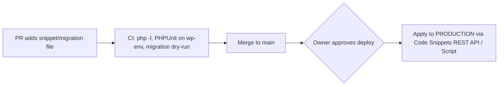
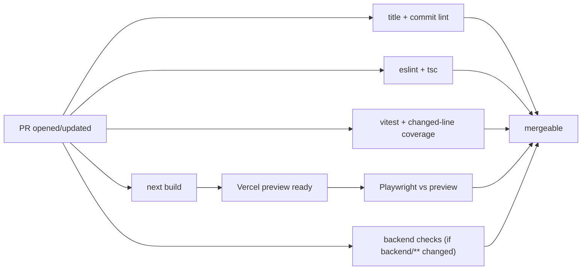

# Engineering Workflow Design (YQ Web Studio / Muslim Atlas)

- **Status:** Draft, awaiting owner review
- **Date:** 2026-10-05
- **Owner:** Yusuf (org owner, final approver)
- **First rollout target:** DQP (`YQ-Web-Studio/discount-quality-products`)
- **Final home:** `YQ-Web-Studio/engineering-handbook/docs/specs/` (moved there once that repo exists)

## 1. Goals and non-goals

### Goals
1. Use a professional, repeatable workflow across all projects: Jira ticket → branch → TDD → PR → CI → (review) → merge → deploy.
2. Contributors can onboard easily: one `CONTRIBUTING.md` and about 10 minutes to a running local environment.
3. **Development is agent-first for everyone.** Every step must be doable by an AI agent to a good standard, and every rule an agent could skip must also be enforced by a machine (CI, hooks or permissions).
4. Nobody except the owner can change production, and that includes the WordPress backend.
5. **Zero additional spend.** Only free tiers of tools already in use, or free tools.

### Non-goals
- Sprints, estimates or deadlines. The boards are Kanban only.
- Full test backfill of legacy code. Only high-risk paths get tests up front.
- A separate staging backend for every branch.
- Detailed rollout for projects other than DQP. They adopt the handbook later, each with its own plan.

## 2. Context (current state of DQP)

- Next.js 16 headless storefront on Vercel (Hobby plan). The backend is WordPress + WooCommerce on Bluehost (`admin.discountproducts.co.uk`).
- All work is committed straight to `main`. There are no tests, no CI, no PR or issue templates and no branch protection.
- Backend code changes are made in the WordPress admin through the **Code Snippets** plugin, so they never appear in any diff.
- Bluehost provides SSH access and one-click staging (not created yet).
- GitHub orgs `YQ-Web-Studio` and `Muslim-Atlas` are both on the **Free** plan. The DQP repo is **public**.

## 3. Organisation structure

### 3.1 Repositories

| Repo | Visibility | Purpose |
|---|---|---|
| `YQ-Web-Studio/engineering-handbook` | Public | **Master copy** of workflow docs, agent skills, reusable GitHub Actions workflows (`workflow_call`), templates, and this spec. Public so that repos in both orgs can call its workflows for free. Contains no project code or secrets. |
| `YQ-Web-Studio/.github` | Public | Default PR and issue templates, `CONTRIBUTING.md` and `CODE_OF_CONDUCT.md` for the YQ-Web-Studio org. Synced from the handbook. |
| `Muslim-Atlas/.github` | Private | The same files for the Muslim-Atlas org. Synced from the handbook. |
| Each project repo | Per project | Small `ci.yml` that calls the handbook workflows, `.agents/skills/` (synced), project `AGENTS.md`, `CLAUDE.md` → `@AGENTS.md`. |

Skill sync: a `sync-handbook` script (and GitHub Action in the handbook) opens a PR in each project repo whenever the master skills or templates change. Projects never edit synced files directly; they override behaviour in their own `AGENTS.md`.

### 3.2 Repository profiles

Each repo declares one profile in `AGENTS.md`. Upgrading to a paid plan later just means switching profile.

| Concern | **Public profile** (DQP) | **Private-free profile** (Muslim Atlas) |
|---|---|---|
| Who can see the code | Public | Org members & invited contributors only |
| Contributor access | **Write** collaborator, branches directly in the repo | **Write** collaborator, branches directly in the repo |
| Workflow | Branch (`feat/<ticket>-...`) → PR → Review → Merge | Branch (`feat/<ticket>-...`) → PR → Review → Merge |
| Protecting `main` | GitHub **ruleset**: PR required, required status checks | Local `husky` pre-push hook blocks direct push to `main` + team/agent workflow standards |
| Required CI | Enforced by GitHub ruleset | Status checks on PR, verified before merge |
| Production approval gate | GitHub Environment `production` with owner approval | Owner-controlled deployments / credentials |
| CI minutes | Unlimited | 2,000 min/month: path filters, `concurrency` cancel, caching |
| AI reviewer | CodeRabbit (free for public repos) | `ai-review` GitHub Action using GitHub Models / local agent review |
| Hosting deploys | Vercel Git integration | Project-specific (Expo / EAS) |

## 4. Jira

- **Site:** `https://yqwebstudio.atlassian.net`
- **Dedicated Projects:** Each codebase has its own dedicated Jira project key:
  - **`DQP`**: Discount Quality Products (tickets: `DQP-1`, `DQP-2`, ...)
  - **`MA`**: Muslim Atlas (tickets: `MA-1`, `MA-2`, ...)
  - **`FMMS`**: Faizan-e-Madina Southend (tickets: `FMMS-1`, `FMMS-2`, ...)
- **Boards:** Dedicated Kanban board per project capturing all tickets automatically.
- **Columns / statuses (4-column flow):**
  - **`To Do`**: Backlog of refined, ready-to-implement tickets.
  - **`In Progress`**: Active implementation on branch (`feat/...`).
  - **`In Review`**: Pull Request is open. Covers:
    1. Automated CI execution (lint, typecheck, Vitest unit/integration tests).
    2. Automated Playwright E2E tests against live Vercel preview.
    3. AI Code Review (CodeRabbit / GitHub Models bot).
    4. Manual exploratory smoke-test on the Vercel preview by the owner.
    5. Final human review sign-off.
  - **`Done`**: PR approved, squash-merged to `main`, and deployed.
- **Agent access:** The Atlassian official Remote MCP server (`https://mcp.atlassian.com/v1/sse`) with OAuth. Each developer connects their own account. No tokens are stored on disk.
- **GitHub link:** The free "GitHub for Jira" app, linking branches, commits and PRs to tickets automatically via the ticket key (`DQP-n`, `MA-n`, `FMMS-n`).
- **Status automation** (GitHub for Jira rules / MCP fallback):
  - branch created → In Progress
  - PR opened → In Review
  - PR merged → Done

### 4.1 Ticket template
| Field | Content |
|---|---|
| Project | Target project (`DQP`, `MA`, or `FMMS`) |
| Type | Story / Bug / Task / Spike |
| Summary | Imperative, ≤ 70 chars |
| Description | User story ("As a…, I want…, so that…") or, for bugs, steps to reproduce / expected / actual |
| Acceptance Criteria | Given/When/Then list; every item must be testable |
| Technical Implementation | Files/areas to change, approach, **plus backend changes**: snippet files, migration files, or manual runbook steps for the WordPress admin |
| Backend Changes | `none` / `snippet` / `migration` / `manual-runbook` |
| Test Plan | Unit / integration / e2e tests to add |
| Definition of Done | Standard checklist (§7.3) |

## 5. Git workflow (GitHub Flow)

- `main` is always deployable, and production deploys from `main`.

### 5.1 Branch Naming Specification

All branches across the organization (`YQ-Web-Studio` and `Muslim-Atlas`) must follow a strict, unified naming convention. This ensures automatic synchronization with Jira Kanban boards, clear repository history, and automated branch validation in git hooks.

#### Pattern
```text
<type>/<TICKET-KEY>-<short-description>
```
Regex pattern: `^(feat|fix|test|refactor|perf|chore|docs|ci|spike|hotfix)\/([A-Z]+-[0-9]+-)?[a-z0-9-]+$`

#### Standard Types & Examples

| Type | When to Use | DQP Example | MA Example | FMMS Example |
| :--- | :--- | :--- | :--- | :--- |
| `feat` | New customer-facing feature or capability | `feat/DQP-12-apple-pay-checkout` | `feat/MA-5-quran-audio-player` | `feat/FMMS-10-donation-portal` |
| `fix` | Bug fix, UI defect, or logic correction | `fix/DQP-42-vat-exempt-shipping` | `fix/MA-18-prayer-time-offset` | `fix/FMMS-4-timetable-sync` |
| `test` | Adding, backfilling, or updating test suites | `test/DQP-8-checkout-vitest` | `test/MA-22-hadith-search-e2e` | `test/FMMS-7-events-calendar` |
| `refactor`| Code restructuring without feature/API changes | `refactor/DQP-20-cart-state` | `refactor/MA-14-theme-tokens` | `refactor/FMMS-9-navigation` |
| `perf` | Caching, query speedup, ISR tuning | `perf/DQP-9-product-isr-revalidate` | `perf/MA-30-audio-streaming` | `perf/FMMS-12-hero-lcp-speed` |
| `docs` | Documentation, specs, handbooks, READMEs | `docs/DQP-1-engineering-workflow` | `docs/MA-1-architecture-spec` | `docs/FMMS-1-project-handbook` |
| `chore` | Tooling, dependencies, config files | `chore/DQP-3-upgrade-nextjs-16` | `chore/MA-7-eslint-flat-config` | `chore/FMMS-3-tailwind-upgrade` |
| `ci` | GitHub Actions, test matrix, CI triggers | `ci/DQP-6-playwright-cache` | `ci/MA-4-eas-build-action` | `ci/FMMS-2-deploy-workflow` |
| `spike` | Timeboxed technical spike / exploratory PoC | `spike/DQP-15-algolia-evaluation` | `spike/MA-9-offline-sync-engine` | `spike/FMMS-8-live-audio-stream` |
| `hotfix` | Critical production outage or payment failure | `hotfix/DQP-99-stripe-webhook-500` | `hotfix/MA-99-auth-token-crash` | `hotfix/FMMS-99-stream-offline` |

#### Branch Rules
1. **Uppercase Project Prefix:** The Jira ticket key must always be uppercase (e.g., `DQP-1`, never `dqp-1`).
2. **Kebab-Case Slugs:** Short description must be 2 to 5 words, lowercase, hyphen-separated (e.g. `vat-exempt-shipping`).
3. **Never Include Personal Names:** Do not prefix branches with personal names (e.g. `yusuf/fix-vat` ❌). Ownership is tracked via GitHub and Jira assignees.
4. **Unticketed Spikes:** If performing pure research before a Jira ticket exists, use `spike/<short-description>` (e.g. `spike/meilisearch-poc`). All production code changes require a ticket.
5. **Jira Synchronization:** When a branch with `<PROJECT>-<NUMBER>-` is pushed to GitHub, Jira's GitHub integration automatically links the branch to the issue and transitions it from `To Do` to `In Progress`.

#### Anti-Patterns to Avoid
| Bad Branch Name | Why It Fails | Correct Format |
| :--- | :--- | :--- |
| `yusuf/fix-vat` | Personal namespace, missing type, missing ticket | `fix/DQP-42-vat-exempt-shipping` |
| `DQP-12` | Missing type prefix and semantic slug | `feat/DQP-12-apple-pay-checkout` |
| `feature/new-cart` | Full word `feature/` instead of standard `feat/`, missing ticket | `feat/DQP-15-new-cart-drawer` |
| `fix_vat_calculation` | Uses underscores, missing type, missing ticket | `fix/DQP-42-vat-calculation` |
| `feat/dqp-1-workflow` | Lowercase project key `dqp` (breaks Jira auto-linking) | `feat/DQP-1-workflow` |

### 5.2 Commits and PRs

- **Commits** (Conventional Commits with project tag and ticket key):
  ```
  [DQP] fix(checkout): exempt 1st class postage from VAT (DQP-42)
  ```
  The `[PROJECT]` tag matches the repo's project code. Enforced by `commitlint` (husky `commit-msg` hook) and checked in CI.
- **PR title:** the same format (`[DQP] fix(checkout): exempt 1st class postage from VAT (DQP-42)`), enforced by a CI check. PRs are **squash-merged**, so the PR title becomes the commit on `main`.
- **Branch retention:** branches are **not** deleted automatically. Branches cost nothing; Vercel builds a preview for every push whether a branch is new or reused.
  - Default: a new branch per ticket.
  - Reuse is allowed, but only after `git fetch && git reset --hard origin/main`. Otherwise squash-merged commits come back as phantom changes. The `start-ticket` skill does this automatically.
  - A monthly `branch-report` script lists merged or stale branches. It only reports; it never deletes.
- **Previews:** every PR gets a Vercel preview URL (public profile), and e2e tests run against it.

## 6. Environments and backend (WordPress)

### 6.1 Environments

| | Production | Local / Contributor Dev | CI Environment |
|---|---|---|---|
| WordPress/Woo | `admin.discountproducts.co.uk` (Client hosting) | `@wordpress/env` (Docker) on developer's machine | `@wordpress/env` running in GitHub Actions |
| What it reflects | Released `main` | Developer's active branch | Head commit under test |
| Who changes it | Owner-approved deploy script/action only | Developer | Automated test runners |
| Frontend | Vercel Production | `npm run dev` (reads live catalog for browsing, or local WP for checkout/admin tests) | Vercel Preview (mocked/test endpoints) |
| Payments | Stripe/PayPal **live** | Stripe **test mode**, PayPal **sandbox** | Mocked (MSW) or Stripe test mode |
| Email | Resend, real customers | Resend test key / dev trap | Mocked / dev trap |
| Data | Real live client data | Small committed seed fixture (~50 products, categories, shipping, coupons) | Fresh seeded fixture per run |
| Access | **Owner only** | Anyone locally | Ephemeral CI runner |

- **Zero footprint on client's Bluehost:** We do **NOT** create staging sites or extra databases on Bluehost. The client's host only runs production.
- **Frontend catalog reads:** Pure frontend UI/catalog work can read the public GraphQL catalog directly (`https://admin.discountproducts.co.uk/graphql`), which is public and read-only.
- **Backend / checkout / mutation work:** Any work involving orders, user sessions, coupons, or PHP code runs against local `@wordpress/env`. Contributors never receive live WooCommerce API credentials.
- **Security & isolation:** Contributors have zero access or network paths to Bluehost. All testing is fully reproducible on any machine with Docker.

### 6.2 WordPress changes as code
All backend changes live in the repo and show up in the PR diff:

| Kind | Example | Location | Mechanism |
|---|---|---|---|
| Code snippet | VAT filter, custom endpoint | `backend/wordpress/snippets/<slug>.php` with a header block (name, description, scope, ticket) | Synced to the Code Snippets plugin through its REST API (`/wp-json/code-snippets/v1/snippets`). Snippets are tagged `managed-by-git`. |
| Config/data migration | Shipping zone, Woo setting, coupon | `backend/migrations/NNNN-DQP-n-<slug>.ts` | Idempotent script using the WooCommerce/WordPress REST API. Applied migrations are recorded in a WP option, so none runs twice. |
| Manual runbook (last resort) | Settings that can't be scripted | `## Runbook` section in the ticket and PR | Done by hand: staging first, then the owner on production |

**Why the REST API rather than SSH:** Bluehost staging lives on the **same cPanel account** as production, so any SSH key for staging also gives access to production. Application passwords are **per WordPress site**, so a staging credential can't affect production. SSH stays an owner-only tool.

The existing snippets get exported from the plugin into `backend/wordpress/snippets/` and tagged `managed-by-git` (one migration ticket).

### 6.3 Backend deploy flow

- Snippets and migrations are validated first on local Docker `@wordpress/env`, then verified in CI.
- Deploying to production is gated strictly on **explicit owner approval**. The production application password is never shared with contributors or third-party bots.
- **Nightly drift check:** compares production snippets and the migration log against the repo. If they differ (e.g. someone edited a snippet directly in the WP admin), it opens a GitHub issue / Jira ticket.

## 7. Review policy

### 7.1 Who needs review
The rule depends only on **which GitHub account opens the PR**, never on whether an agent wrote the code (everyone is expected to use agents):
- **Owner's account** (the owner, or the owner's agent): no review; merge once CI is green.
- **Any other account:** **two reviewers**, the **AI reviewer** (automatic) and the **owner** (human approval).

### 7.2 AI reviewer
- Public profile: **CodeRabbit** free tier, configured with `.coderabbit.yaml` containing the project rules (performance rules, payment safety, WordPress change safety, test quality).
- Private-free profile: the `ai-review` reusable workflow (GitHub Models + the same rules), plus CodeRabbit summaries.
- Before approving, the owner can run the **`code-review` skill**, which reviews the PR against the Jira ticket's acceptance criteria. The bots can't do this because they can't see Jira.

### 7.3 Definition of Done
- [ ] Acceptance criteria met
- [ ] Tests written first (TDD) and passing; changed-line coverage ≥ 80%
- [ ] CI green; required reviews done (contributors)
- [ ] Backend changes validated locally on `@wordpress/env` and CI, then applied to production upon owner approval
- [ ] Docs / `AGENTS.md` updated if behaviour or conventions changed
- [ ] Jira ticket moved to Done with the PR linked

## 8. Testing strategy

| Layer | Tool | Scope |
|---|---|---|
| Unit | Vitest | Pure logic: VAT, coupons, shipping, stock rules, price formatting, mappers |
| Component | Vitest + React Testing Library | Cart, checkout form, product card states |
| Integration | Vitest + MSW | API routes with Woo/Stripe/PayPal mocked: webhook signature, idempotency, duplicate-order guards, revalidation |
| E2E | Playwright | Critical user journeys against the Vercel preview (→ staging): browse → cart → checkout with Stripe test card → success; out-of-stock blocked; search; login |
| Backend | `php -l`, PHPUnit on `@wordpress/env` | Snippets load without fatal errors; migrations are idempotent |

Rules:
- Every ticket uses TDD. Every bug fix includes a test that reproduces the bug.
- Coverage gate applies to **changed lines only** (≥ 80%). There is no whole-repo target.
- Tests never touch production services.
- The Stripe webhook is covered by integration tests that use signed test payloads. E2E checks the redirect to the success page.

**Initial backfill** (one ticket each): Stripe webhook route; coupon → Woo sync + 1st class postage VAT exemption; real-time stock check; Playwright checkout happy path + out-of-stock path.

## 9. CI/CD

The reusable workflows in the handbook, called by each project's `ci.yml`:

- Local hooks (husky): `pre-commit` runs lint-staged; `commit-msg` runs commitlint; `pre-push` runs tsc + vitest (related tests).
- Dependabot runs weekly with grouped updates. `npm audit` runs in CI (fails on high/critical).
- GitHub secret scanning + push protection is on.
- Playwright traces and screenshots are uploaded as artifacts when a run fails.
- E2E against protected Vercel previews uses Vercel's "Protection Bypass for Automation" secret.

## 10. Agent skills and Mandatory Human Confirmation Gates

Master copies live in the handbook and are synced to `.agents/skills/` in every repo. `AGENTS.md` points every agent (Antigravity, Claude Code, Cursor, Copilot) at them.

### 10.1 Skills Overview

| Skill | Responsibility |
|---|---|
| `jira-ticket` | Turns an idea or bug into a ticket using §4.1 (including technical implementation and backend changes). Presents draft for approval, then creates it through the Atlassian MCP with Team set. |
| `start-ticket` | Fetches the ticket, creates or resets the branch, moves the ticket to In Progress, and comments the plan on Jira. |
| `implement` | TDD → implement → verify. Wraps the superpowers skills (test-driven-development, systematic-debugging, verification-before-completion) and enforces the project rules in `AGENTS.md`. |
| `wp-change` | Writes snippet/migration files, tests them on wp-env or staging, and documents any runbook steps. Never uses production credentials. |
| `open-pr` | Runs the full local check, presents PR draft and test evidence for approval, then opens the PR and moves ticket to In Review. |
| `code-review` | Reviews contributor PRs against acceptance criteria, correctness, security, tests, and performance. Presents review draft for human sign-off before submitting. |
| `merge` | Verifies CI is green, presents squash-merge summary, and executes merge only upon explicit human approval. |

### 10.2 Mandatory Human Confirmation Gates (Hard-Gates)

Agents must **never take autonomous action on external platforms (Jira, GitHub, Bluehost) without explicit user confirmation**. The agent must present what it intends to do, display the payload, and wait for a clear confirmation before executing:

1. **Gate 1: Jira Ticket Creation (`jira-ticket`)**
   - *Payload to show:* Ticket Type, Summary, Description, Acceptance Criteria, Technical Plan, Backend checklist.
   - *Gate:* Wait for user approval before creating or modifying Jira tickets.
2. **Gate 2: Branch Creation & Status Change (`start-ticket`)**
   - *Payload to show:* Target branch name, existing commits/status, Jira status transition.
   - *Gate:* Wait for user approval before switching branches or moving tickets.
3. **Gate 3: Opening Pull Requests (`open-pr`)**
   - *Payload to show:* PR Title (with project tag & ticket), PR Description, changed files list, local test verification evidence, and UI screenshots (if applicable).
   - *Gate:* Wait for user approval before pushing the branch to `origin` and creating the PR on GitHub.
4. **Gate 4: Submitting Code Review Comments (`code-review`)**
   - *Payload to show:* Detailed list of inline comments, security/correctness findings, and proposed overall verdict (Approve / Request Changes / Comment).
   - *Gate:* Wait for user approval before submitting any review comments or verdicts to GitHub.
5. **Gate 5: Merging to Main (`merge`)**
   - *Payload to show:* CI status report (all green), PR approval count, and final squash-merge commit message.
   - *Gate:* Wait for user approval before merging into `main`.
6. **Gate 6: Production WordPress Deployment (`wp-change`)**
   - *Payload to show:* Complete PHP snippet / migration code diff and execution plan.
   - *Gate:* Wait for explicit owner approval before running deploy scripts against production.

## 11. Contributor onboarding
- `CONTRIBUTING.md`: prerequisites, clone/fork, `.env.example` (staging/test values), `npm ci && npm run dev`, connecting the Atlassian MCP, the workflow above and the Definition of Done.
- `AGENTS.md`: project profile, project code (`DQP`), architecture overview, hard rules (e.g. the existing performance rules).
- Issue and PR templates. CODEOWNERS = owner.

## 12. Security
- Production credentials are held by the owner only (and in a GitHub Environment for the public profile).
- Contributors get staging and test-mode credentials only.
- Push protection and secret scanning are on. `.env*` files stay gitignored.
- Least privilege throughout: staging WordPress users are Shop Managers; the staging app password belongs to a dedicated staging user.

## 13. Zero-cost check

| Tool | Cost | Notes |
|---|---|---|
| GitHub Free (public: rulesets, environments, unlimited Actions) | £0 | Private repos: permissions-based model, 2,000 min/month |
| Jira Free + automation + GitHub for Jira | £0 | Free plan limits (10 users) |
| Atlassian Remote MCP | £0 | Official Atlassian remote MCP |
| CodeRabbit (public) / GitHub Models (private) | £0 | |
| Vercel Hobby | £0 | Hobby terms are non-commercial. Existing risk for DQP; first item to pay for once there's budget |
| Vitest, Playwright, MSW, husky, commitlint, wp-env | £0 | Open source local Docker tools |

## 14. Rollout (sub-projects, in order)
Each sub-project gets its own implementation plan and Jira tickets.
1. **Jira + MCP:** connect the Atlassian MCP; confirm the Team field ID, statuses and board columns; set up the GitHub for Jira app and automation rules. *This creates the tickets for everything below.*
2. **Handbook repo:** create `engineering-handbook` + the `.github` repos; templates, CONTRIBUTING, skills (§10), reusable workflows (skeleton).
3. **DQP Git workflow:** husky + commitlint, PR template, ruleset, CodeRabbit config, `AGENTS.md` update.
4. **DQP test framework + CI:** Vitest/RTL/MSW/Playwright setup, `ci.yml`, coverage gate, initial backfill tests.
5. **Local WP environment & Seed:** `@wordpress/env` config, seed data fixtures, and environment switcher scripts for local dev.
6. **WordPress as code:** export snippets, sync tool, migrations runner, deploy workflows, drift check.
7. **Muslim Atlas adoption** (separate plan, private-free profile).

## 15. Things to verify early (spikes during rollout)
- The Atlassian MCP can set the **Team** field on create and move statuses (§4).
- Code Snippets REST API: the free version supports create/update with application passwords on Bluehost (§6.2).
- `@wordpress/env` setup and seed catalog load time (§6.1).
- Vercel "Protection Bypass for Automation" is available on Hobby (§9).
- GitHub Models free quota is enough for PR-sized diffs (private profile, §7.2).
